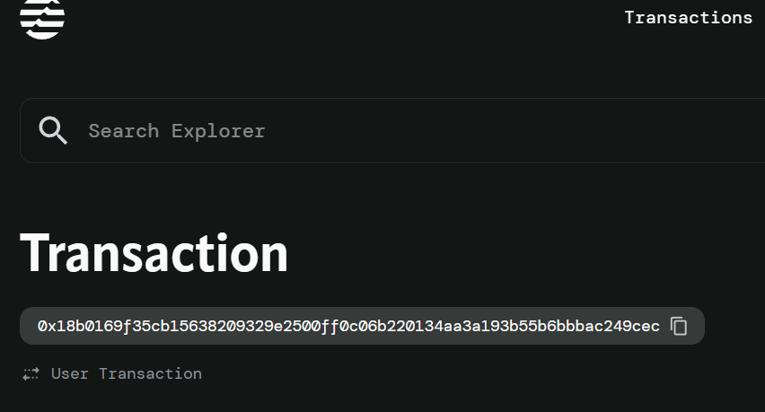

# Land Registry Smart Contract

A decentralized land registry system built on the Aptos blockchain that enables secure land ownership registration, transfer requests, and multi-party approval processes.

## Overview

This smart contract implements a comprehensive land registry system with the following key features:
- User registration and authentication
- Land registration with ownership tracking
- Multi-step land transfer process with approval workflow
- Operator-based governance for transfer approvals
- Event emission for transparency and tracking

## Features

### User Management
- **User Registration**: Users can register with username and password
- **Land Ownership Tracking**: Each user can own up to 10 lands
- **Secure Authentication**: Basic credential validation

### Land Management
- **Land Registration**: Register land parcels with metadata (name, area, location)
- **Unique Land Hashing**: Each land gets a unique hash identifier
- **Ownership Verification**: Only land owners can initiate transfers

### Transfer Process
- **Three-Step Approval Process**:
  1. Transfer request by current owner
  2. Approval by land owner
  3. Final approval by authorized operator
- **Pending Approvals Queue**: Operators maintain a queue of pending transfers

### Governance
- **Operator Role**: Authorized operators can approve final transfers
- **Admin Initialization**: Contract initializes with default admin operator

## Security Considerations

- **Access Control**: Only land owners can initiate transfers for their properties
- **Multi-step Approval**: Prevents unauthorized transfers through multi-party validation
- **Operator Authorization**: Only authorized operators can provide final approvals
- **Land Limits**: Users are limited to 10 lands to prevent spam
- **Status Validation**: Transfer status is validated at each step

## Limitations

- **Password Storage**: Passwords are stored in plain text (consider hashing in production)
- **Land Hash**: Currently uses simple concatenation (implement cryptographic hashing)
- **Static Limits**: Land limit per user is hardcoded
- **Single Operator**: System relies on single operator address for approvals

## Future Enhancements

- Implement proper password hashing
- Add cryptographic land hash generation
- Support multiple operators with different roles
- Add land valuation and pricing mechanisms
- Implement dispute resolution system
- Add land history tracking
- Support partial land transfers

## Development

### Prerequisites
- Aptos CLI
- Move language understanding
- Aptos testnet/devnet account

### Deployment
1. Compile the contract: `aptos move compile`
2. Deploy to network: `aptos move publish`
3. Initialize the contract: Call `initialize` function

### Testing
Ensure comprehensive testing covering:
- User registration edge cases
- Land registration limits
- Transfer approval workflow
- Error condition handling
- Event emission verification

## Contributing

1. Fork the repository
2. Create a feature branch
3. Commit your changes
4. Push to the branch
5. Create a Pull Request

## Support

0xab5d3e5e2605a91396434164b46dd76ecc98f6a44c3e25452b6216e24f1c3f6e

